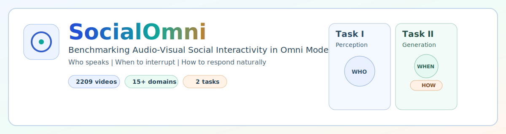
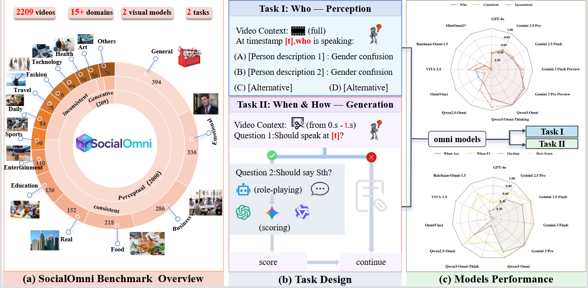

# SocialOmni: Benchmarking Audio-Visual Social Interactivity in Omni Models

<p align="center">
  
</p>

<p align="center">
  <a href="https://github.com/Alexisxty/SocialOmni">GitHub</a>
  ·
  <a href="#quick-start">Quick Start</a>
  ·
  <a href="#benchmark-overview">Benchmark Overview</a>
  ·
  <a href="#evaluation-protocol">Evaluation Protocol</a>
</p>

SocialOmni is a benchmark for **audio-visual social interactivity** in omni models.
Instead of only measuring answer correctness, SocialOmni explicitly evaluates the interaction triad:

- **Who** is speaking (speaker identification)
- **When** interruption is appropriate (timing decision)
- **How** to respond naturally (interruption generation)

This repository contains the benchmark pipeline, model clients/servers, and reproducible evaluation scripts.

## Why SocialOmni

Most multimodal benchmarks are understanding-centric (static QA, final-answer accuracy).
SocialOmni targets a different bottleneck: whether a model can behave correctly in dynamic dialogue turn-taking.

In real-time interaction, user experience depends on both semantic correctness and social timing.
A correct content answer can still fail if the model interrupts too early/too late or responds unnaturally.

## Benchmark Overview

<p align="center">
  
</p>

### Dataset composition

- **2,209** total samples from **2,000** short dialogue videos
- **Perception task**: 2,000 timestamp-level QA items
- **Generation task**: 209 interruption-centric interaction items
- **15** dialogue domains
- Controlled A-V consistency split in perception task:
  - **Consistent**: 86.25%
  - **Inconsistent**: 13.75%

### Annotation quality

- Two-round expert verification
- Reported inter-annotator agreement (IAA):
  - Perception: **94.2%**
  - Generation: **91.8%**

## Tasks

### Task I: Perception (Who)

Given a video and timestamp `t`, answer:

> "At timestamp `t`, who is speaking?"

The model selects one option from `{A, B, C, D}`.

### Task II: Generation (When + How)

Given video prefix `V[0:t]` and candidate speaker `X`, the model performs:

- **Q1 (When)**: binary decision on whether `X` should interrupt immediately after `t`
- **Q2 (How)**: if Q1 predicts interruption, generate natural interruption content

## Evaluation Protocol

### Perception metrics

- Top-1 Accuracy (overall)
- Split-wise Accuracy on consistent/inconsistent subsets
- Gap: `Δ = Acc_consistent - Acc_inconsistent`

### Generation metrics

- **Q1**: Accuracy / Precision / Recall / F1 under tolerance windows (e.g., δ=0.2s)
- **Q2**: LLM-judge score on `{0, 25, 50, 75, 100}`

Q2 uses three independent judges in the paper protocol:

- GPT-4o
- Gemini 3 Pro
- Qwen3-Omni

## Main Results (from paper table)

| Model | Perception Overall (%) | Q1 Acc. (%) | Q2 Score (/100) |
|---|---:|---:|---:|
| Gemini 3 Pro Preview | 64.99 | **66.99** | 81.77 |
| Qwen3-Omni | **69.25** | 63.64 | 45.57 |
| Gemini 2.5 Flash | 47.03 | 58.85 | **85.08** |
| GPT-4o | 36.75 | 46.89 | 69.64 |

Observation: perception ranking and generation quality are not strictly aligned, supporting the need for joint who/when/how evaluation.

## Repository Structure

```text
SocialOmni/
├── models/                  # model servers, clients, and shared pipeline logic
├── config/                  # runtime/model/benchmark configurations
├── data/                    # local datasets (not tracked)
├── results/                 # local outputs (not tracked)
├── scripts/                 # utility scripts
├── docs/                    # documentation and visual assets
├── run_benchmark.py         # Task I (Level1) entrypoint
├── run_benchmark_level2.py  # Task II (Level2) entrypoint
└── README.md
```

## Quick Start

### 1) Clone and install

```bash
git clone https://github.com/Alexisxty/SocialOmni.git
cd SocialOmni
uv sync
```

### 2) Configure runtime

Edit `config/config.yaml` and set at least:

- API endpoints / keys (or env vars)
- model paths / server URLs for local models
- benchmark dataset paths and output paths

Environment variable overrides are supported, e.g.:

- `OPENAI_API_KEY` / `OPENAI_API_BASE`
- `GEMINI_API_KEY` / `GEMINI_API_BASE`

### 3) Start local model server (example)

```bash
uv run models/model_server/qwen3_omni/qwen3_omni_server.py
```

Other server entrypoints are available under `models/model_server/*/*_server.py`.

### 4) Run benchmark

Task I (Perception):

```bash
uv run run_benchmark.py --model qwen3_omni
```

Task II (Generation):

```bash
uv run run_benchmark_level2.py --model qwen3_omni --resume
```

## Supported Model Keys

Use these model keys with `--model`:

`gpt4o`, `gemini_2_5_flash`, `gemini_2_5_pro`, `gemini_3_flash_preview`, `gemini_3_pro_preview`, `qwen3_omni`, `qwen3_omni_thinking`, `qwen2_5_omni`, `miniomni_2`, `omnivinci`, `vita_1_5`, `baichuan_omni_1_5`, `ming`

## Reproducibility Notes

- Keep data and output directories local and out of version control.
- Use fixed prompts and model configs for cross-model comparison.
- Report confidence intervals and split-wise metrics when claiming improvements.

## Citation

If you use SocialOmni in research, please cite the paper:

```bibtex
@article{socialomni2026,
  title={SocialOmni: Benchmarking Audio-Visual Social Interactivity in Omni Models},
  author={Anonymous},
  journal={ECCV},
  year={2026}
}
```

(Please update this entry with the final camera-ready metadata.)

## License and Data Usage

- Code and benchmark protocol: see repository license (to be finalized)
- Video assets and metadata follow source licensing constraints; use responsibly and comply with original licenses

## Acknowledgment

SocialOmni is motivated by the gap between understanding-centric evaluation and real conversational interaction requirements in omni models.
